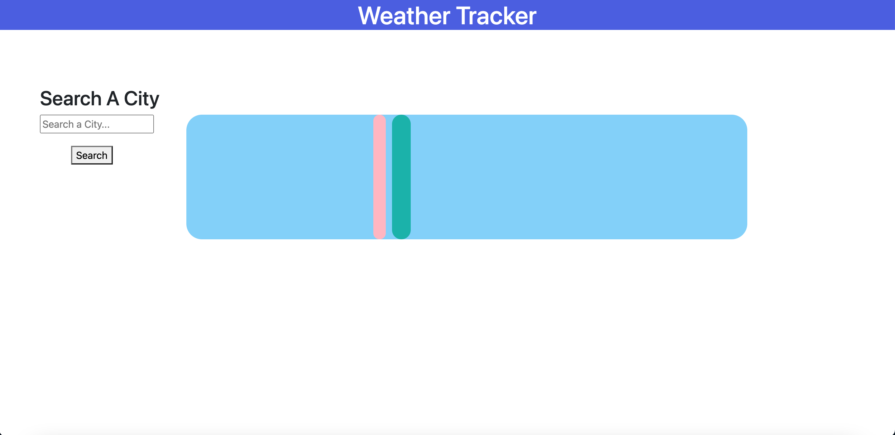
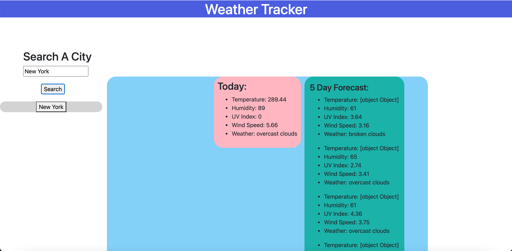

# Weather Dashboard Project

## Description

For this project I was assigned to create a weather dashboard using HTML, CSS, and Javascript with a responsive user interface. I was assigned to display user searches, the current days weather with the items of weather conditions, the temperature, the humidity, the wind speed, and the UV index as well as forecast for the next five days with the same items of the city selected by the user. 

## Installation

To install this project you simply need to be able to access a Google Chrome browser window and have a reliable internet connection. 

Open a browser window, copy and past this link () into the URL section, and view the webpage upon loading. 

Enter a city name and click search.

View the weather forecast for today and the next five days.

## Usage

Search the weather of a city by typing in a city name and clicking search:

View the current days weather and the forecast for the next five days:

 
## Built With

HTML
CSS
Javascript
Jquery

## Deployable Link

## Authors

Alec Mackenzie

## Links

Github Repo: https://github.com/amackenzie26/weather-tracker-app
URL: 

## License

    
## Credits

Thank you for assistance from BCB Staff, my tutor Aaron Parnell, W3schools.com, stackoverflow.com.
